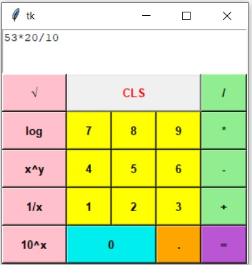

# GUI-CALCULATOR
### This is a GUI- CALCULATOR formed using tkinter and can be used
to perform scientific calculations.

# Working Screenshot

# Features
This calculator can be used to peform on multiple
operations at a single time and also it take care
of the BODMAS(Brackets, Orders, Division/Multiplication, Addition/Subtraction)
